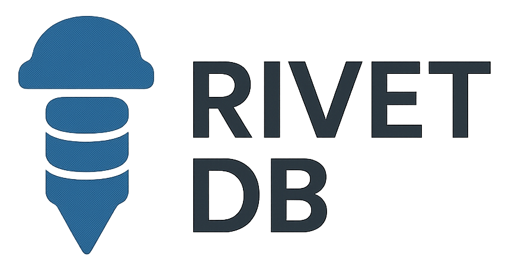

<div align="center">
  <picture>
    <source srcset="logo/rivetdb-logo-transparent.png">
    
  </picture>
</div>


# RivetDB

> _Query everything — **instantly**._

RivetDB is a high-performance, federated query engine built on a smart, just-in-time cache.

It provides a Trino-style SQL interface for querying remote data sources without needing heavy infrastructure. The goal is to unify data access across systems while still getting fast, reliable performance on a single node.

RivetDB takes inspiration from [DuckDB](https://duckdb.org/) and the Small Data community, which has shown how much you can get out of a single machine when you pair simplicity, vectorized execution, and efficient columnar formats. RivetDB applies that same thinking to federated data, using Arrow-native execution to make remote sources feel local. We think this is going to be especially important as agents query disparate systems and want to avoid scattering data fetching logic.

Under the hood, RivetDB is built in Rust and powered by [Apache DataFusion](https://datafusion.apache.org/), providing strong safety guarantees, great performance, and a solid execution engine that plays well with Arrow.

RivetDB is under active development, and the APIs will continue to shift as we move toward a stable 1.0 release.

> **🚧 Early Development:** We are targeting a public preview with caching, lookup APIs, and a CLI in **Q1 2026**.  
> Expect breaking changes until the API surface stabilizes.

---

## Getting Started

RivetDB is evolving quickly and installation instructions will change.  
To experiment with the current engine:

```bash
docker pull ghcr.io/hotdata-dev/rivetdb:latest
docker run -p 3000:3000 ghcr.io/hotdata-dev/rivetdb:latest
```

Alternatively/additionally, you can build and run locally: 
```bash
 cargo run --bin server config-local.toml
```

---


## What RivetDB does Today

- Just-in-time retrieval of remote data  
- Federated SQL interface inspired by Trino  
- Rust-powered engine focused on performance and correctness  
- Basic caching and early internal APIs  
- Initial examples and tests  
- **Current adapter support:**  
  - **Postgres**  
  - **DuckDB**  
  - **MotherDuck**  

This foundation supports the larger roadmap described below.

---

## Vision

RivetDB aims to become a unified query engine that eliminates challenges working with between disparate data systems. The project emphasizes:

- A consistent SQL interface for structured, semi-structured, and remote data sources
- Millisecond startup times for on-demand ephemeral compute 
- Intelligent caching that adapts to query patterns and reduces data movement
- Tooling that gives developers introspection into data, metadata, and performance
- Developer-friendly documentation and APIs

The long-term goal includes distributed caching, additional connectors, real-time introspection, and seamless orchestration integration.

---

## Roadmap

Roadmap items below correspond directly to open issues in the repository.  
For the latest view, consult: https://github.com/hotdata-dev/rivetdb/issues

### **📍 Version 0.1 — Core Feature Set (Current Development)**

These features define the first stable preview of RivetDB:

- **Parquet Metadata Cache**  
  Cache Parquet metadata to optimize planning and repeated reads.

- **Result Lookup API**  
  Provide structured access to intermediate query results for debugging and tooling.

- **Query Metadata API**  
  Expose information about query execution: planning, caching, durations, and more.

- **Table Caching Support**  
  Enable caching of entire remote tables for repeated or incremental queries.

- **Arrow Flight SQL Support**  
  Add high-performance transport for large result sets and client libraries.

- **RivetDB CLI**  
  Build a command-line interface for running queries, inspecting cache state, and interacting with the engine.

These are high-priority items and represent the minimum surface for an early release.

---

### **🚀 Future Themes (Post-0.1)**

These represent emerging priorities after the first public preview:

- **Additional Connectors**  
  Planned support for major databases and warehouses, including:  
  - MySQL / MariaDB  
  - SQLite  
  - BigQuery  
  - Snowflake  
  - Redshift  
  - Databricks / Unity Catalog  
  - ClickHouse  
  - Athena  
  - Synapse / Fabric  
  - Generic JDBC  
  - REST and streaming sources  
  - Cloud storage systems (S3, GCS, Azure Blob)

- **Distributed Caching & Invalidation**  
  Peer-aware caching and consistency guarantees across nodes.

- **Observability & Telemetry**  
  Metrics, tracing, execution timelines, and debugger-friendly diagnostics.

- **Developer Tooling & IDE Integrations**  
  Schema discovery, query explain tools, and interactive exploration.

---

## Feature Status (At-a-Glance)

| Feature | Status |
|--------|--------|
| Parquet Metadata Cache | Planned |
| Result Lookup API | Planned |
| Query Metadata API | Planned |
| Table Caching | Planned |
| Arrow Flight SQL | Planned |
| RivetDB CLI | Planned |
| Cache | Alpha |
| Current Connectors: Postgres, DuckDB, MotherDuck | Alpha |
| Observability | Backlog |
| Additional Connectors | Backlog |
